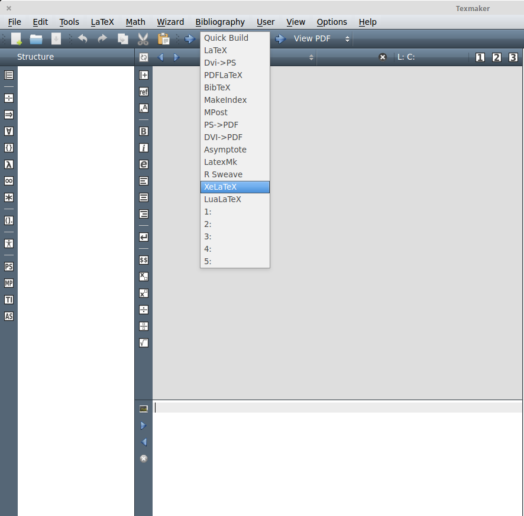
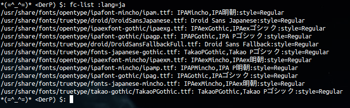

#CV Templates
Here is a Latex resume template that is intended to be easy to fill out, even if you don't have very much experience with Latex.  Below I have also included a guide for writing Latex in Japanese.  I needed to be able to type a resume in Japanese, but could find no clear guides on getting latex to compile Japanese text smoothly, so I made one for myself and have left it below.

How To LaTeX in Japanese (Ubuntu)
-------------------------
-------------------------
When I was first starting this project I had a great deal of trouble trying to get LaTeX to compile my resume in Japanese.  I run ElementaryOS which is built on Ubuntu LTS, so the guide below should work for any Ubuntu-based distributions of linux.  This guide assumes that you already have Japanese typing enabled on your system. At the end of the guide I will include an example of a LaTeX template that you can use for Japanese.   

A Step-by-Step Guide
-------------------------
1. Install Texmaker.
    
        sudo-apt-get install texmaker

2. Add Xetex.  This allows for unicode input, so LaTeX can handle Japanese typing. 

         sudo apt-get install texlive-xetex

3. Open Texmaker, either by searching for it in applications, or by typing texmaker into your terminal.  On the toolbar at the top click the drop-down menu next to where it says Quick Build and select XeLaTex as in the picture below.  Now you're ready to write and compile a document.

	

4. First, we'll need to see what font styles are available on your system. 

        fc-list :lang=ja

	The output should look something like this.

	 

	What you see is a list of long paths with .ttf files at the end.  These files contain the fonts you can use.

5.  In the preamble we first need to tell LaTex that we want to use our own font, and then specify one of the fonts listed in the output of the previous command. This is accomplished by the first two lines below (I just picked the first font listed in the picture above).  The third line is used to handle line breaks and document structure.  Because Japanese has no spaces, LaTex has trouble formatting the document otherwise. The last line is purely optional, I prefer to have some extra spacing between my paragraphs in Japanese, so it tells Latex to skip some space.

        \usepackage{fontspec} 
        \setmainfont{ipam.ttf}
        \XeTeXlinebreaklocale "jp"
        \setlength{\parskip}{2ex}"

6. As promised, an example of a LaTeX template in Japanese.  Remember to compile with XeTeX.  You can view the document in Texmaker by clicking the view pdf button immediately to the right of XeLaTeX in the toolbar.

        \documentclass[12pt]{book}
        \usepackage{fontspec} 
        \setmainfont{fonts-japanese-mincho.ttf}
        \XeTeXlinebreaklocale "jp"
        \setlength{\parskip}{2ex}
        
        \begin{document}
        何かを書きなさい。
        \end{document}

[Back to top](#cv-templates)

