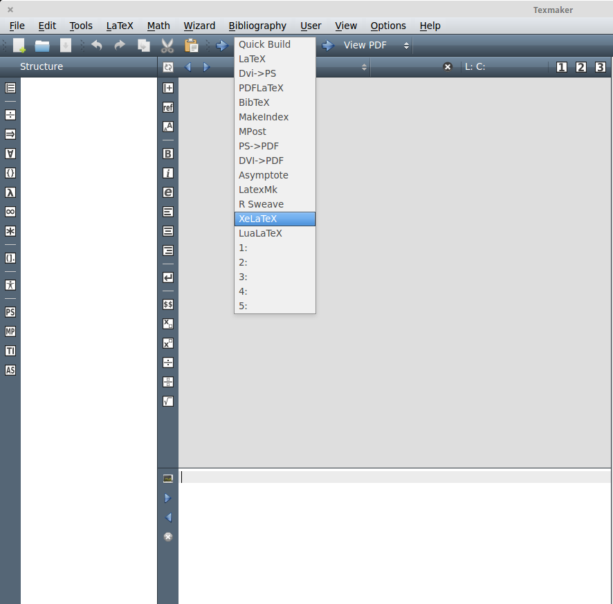
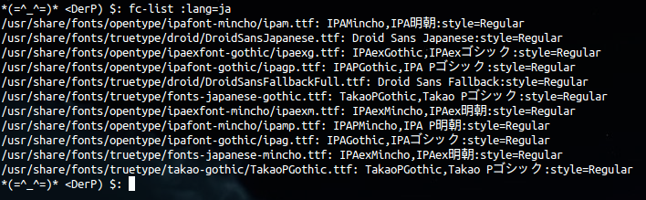
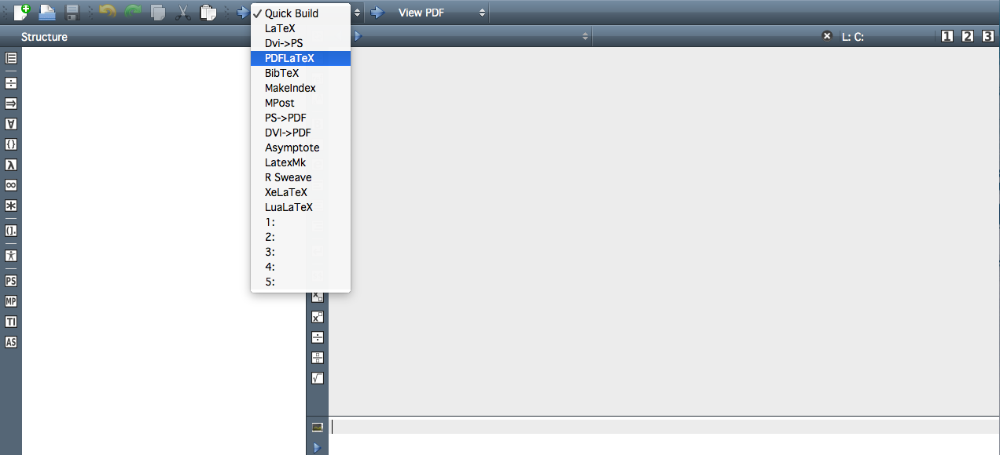
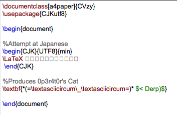
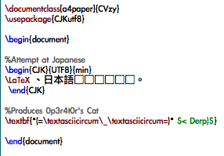
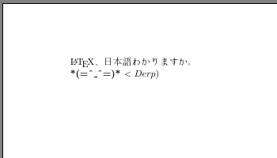
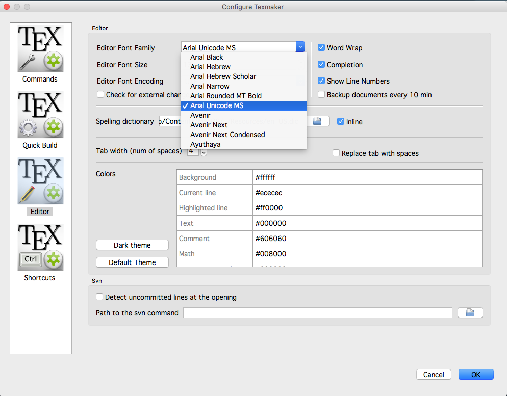
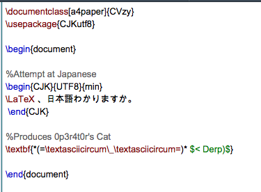

# CV Templates
A quick and easy LaTeX resume template. This repository also incldes guidlines for compiling a latex document in Japanese.

### Table of Contents
* How to LaTeX in Japanese
    * [Arch Linux (2019)](#arch-2019) 
    * [Ubuntu (2016)](#ubuntu-2016)
    * [MacOS (2016)](#macos-2016)

Arch (2019)
-------------------------
-------------------------
The steps for arch are the same as those for [Ubuntu](#ubuntu-2016). However, you'll need to install Japanese fonts. There are several font pacakges for Japanese available, but the `otf-ipafont` package worked for me without any fuss. 

1. Install Japanese fonts. Please refer to the [Arch Wiki](https://wiki.archlinux.org/index.php/Fonts#Japanese) for more details.

        pacman -S otf-ipafont

2. Follow the steps outlined in the [Ubuntu (2016)](#ubuntu-2016) section of this guide.

3. Comple the document from the command line by running...

        pdflatex jpCV.tex

Ubuntu (2016)
-------------------------
-------------------------
I run ElementaryOS which is built on Ubuntu LTS, so the guide below should work for any Ubuntu-based distributions of linux.  

See the end of this section for a simple LaTeX template that you can use for Japanese.

1. Install Texlive and Texmaker if you haven't already.

        sudo-apt-get texlive texmaker

2. Now we need to install some additional packages to support Japanese (cjk stands for ChineseJapansesKorean). 

        sudo apt-get install texlive-lang-cjk

3. Open Texmaker, either by searching for it in applications, or by typing texmaker into your terminal.  On the toolbar at the top click the drop-down menu next to where it says Quick Build and select XeLaTex as in the picture below.  Now you're ready to write and compile a document.

	

4. First, we'll need to see what font styles are available on your system. 

        fc-list :lang=ja

	The output should look something like this.

	 

	What you see is a list of long paths with .ttf files at the end.  These files contain the fonts you can use.

5.  In the preamble we first need to tell LaTex that we want to use our own font, and then specify one of the fonts listed in the output of the previous command. This is accomplished by the first two lines below (I just picked the first font listed in the picture above).  The third line is used to handle line breaks and document structure.  Because Japanese has no spaces, LaTex has trouble formatting the document otherwise. The last line is purely optional, I prefer to have some extra spacing between my paragraphs in Japanese, so it tells Latex to skip some space.

        \usepackage{fontspec} 
        \setmainfont{ipam.ttf}
        \XeTeXlinebreaklocale "jp"
        \setlength{\parskip}{2ex}"

6. As promised, an example of a LaTeX template in Japanese.  Remember to compile with XeTeX.  You can view the document in Texmaker by clicking the view pdf button immediately to the right of XeLaTeX in the toolbar.

        \documentclass[12pt]{book}
        \usepackage{fontspec} 
        \setmainfont{fonts-japanese-mincho.ttf}
        \XeTeXlinebreaklocale "jp"
        \setlength{\parskip}{2ex}
        
        \begin{document}
        何かを書きなさい。
        \end{document}

[Back to top](#cv-templates)

MacOS (2016)
-------------------------
-------------------------
At the time of writing I am running macOS Sierra Version 10.12.2 and am using the MacTex-2016 distribution.  My Texmaker is version 4.5.  This is less a guide on how to type Japanese and more a solution a problem with Texmaker.  I couldn't find a solution online, but after a couple days of frustration I resolved the issue and created the guide you see below.

1.  There are many different ways you could go about compiling LaTeX documents in Japanese.  For the sake of this example I'll be using PDFLaTeX because the code is simple and fairly easy to understand.  So before you try out the code, go ahead and switch your compiler to PDFLaTeX.

2.  Now let me show you the exact problem I was having.  I realized that there are two potential ways the problem may present itself.  The first is as described above.  In place of Japanese pictures you see little boxes.

 

Alternatively, you could have Texmaker rendering the Kanji, but still have boxes in place of the Hiragana and Katakana.  Like this.

3.  The strange thing is, if we go to compile our document, we will get the proper output (even with the boxes).

This means that Texmakers can comprehend, the input you're giving it.  However, it doesn't have the right settings to actually show that input in the editor.  This happens because ** the font on the editor can't handle Japanese symbols.  We need to change the editor font. **

4.  Open Texmaker preferences (keyboard shorcut should be ⌘,).  Then select "Editor" from the menu on the left.  Look for the section labeled "Editor Font Family" and try selecting different fonts until you find one that suits your liking and that can render all three of the Japanese alphabets.

5.  You should now be able to see the Japanese as you type it into the editor!

     
  

[Back to top](#cv-templates)

